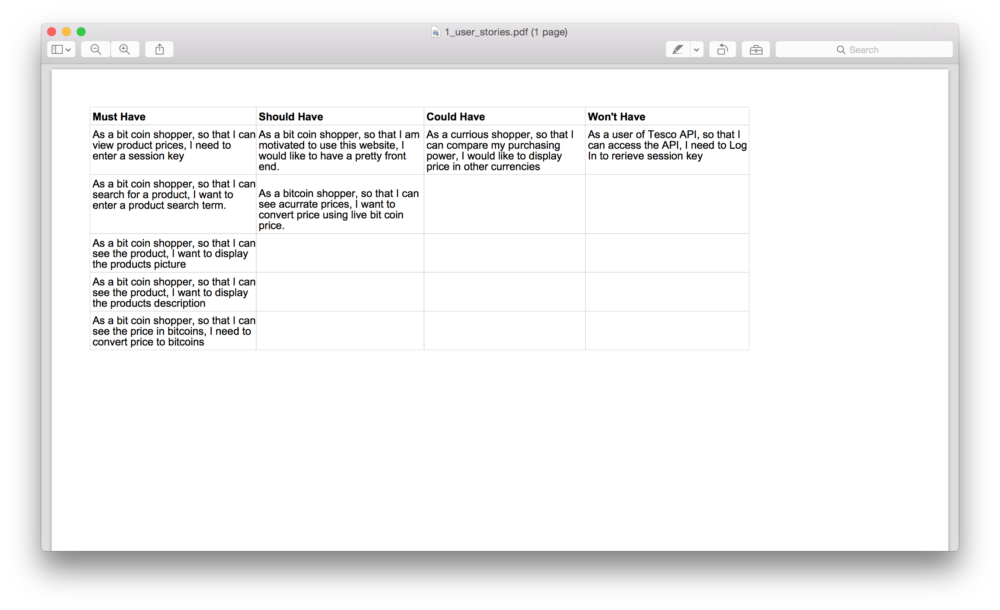
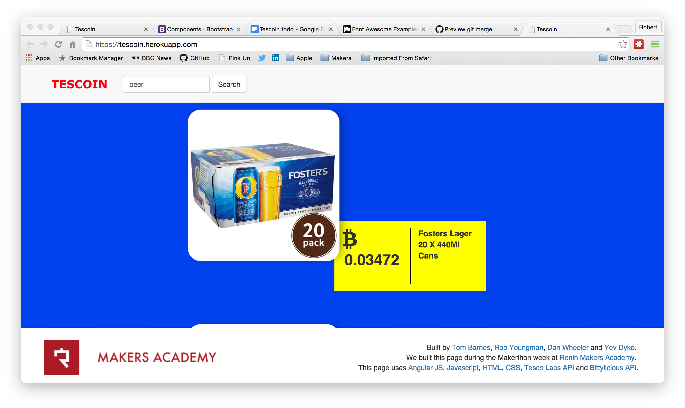
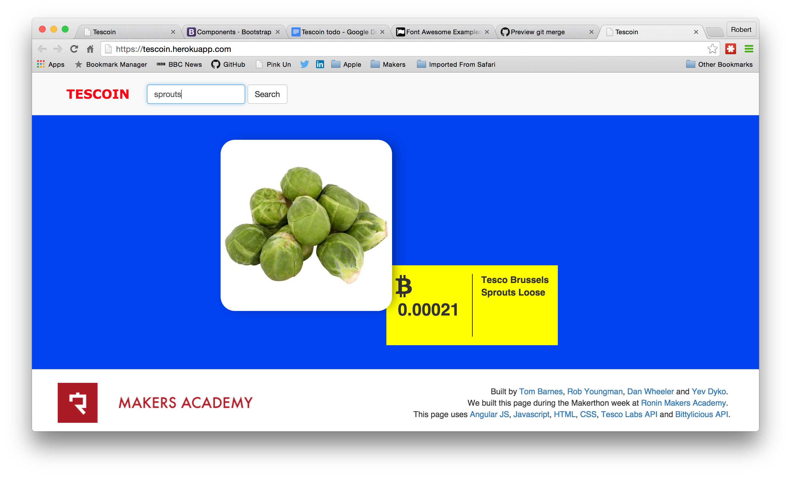
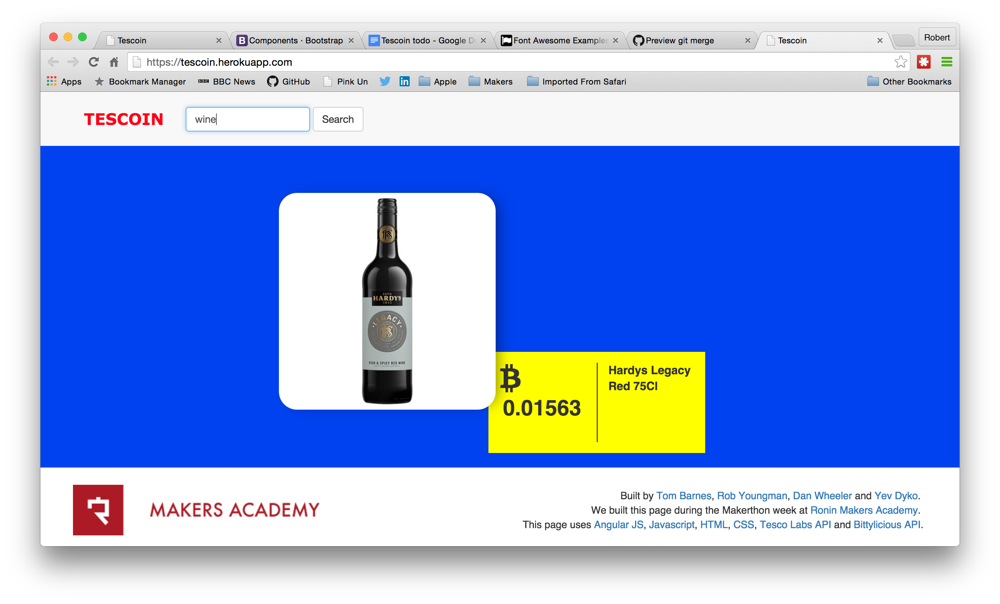

Objective of the Tescoin project
================================

To develop a website which enable users to search the Tesco on-line shopping catelog and display the searched items priced in bitcoins using the real time exchange rate obtained from the bittylicious bitcoin exchange. 

User Stories
============

Link to user stories
* https://docs.google.com/spreadsheets/d/1Q6hG9aBY7lSwlUnbUx1afprLKVxiOUhd8JSAa1beGms/edit#gid=0&vpid=A1

Deployment on local browser
=====================================================
* git clone https://github.com/youngmanr/tescoin tescoin
* git pull origin master
* npm install
* open index.html

Deploying to heroku
===================

* heroku create tescoin
* git push heroku master
* heroku open

Instruction for using tescoin website
=====================================

* Tescolabs online store api requires users to 
  * have registered as a developer and registered their app
  * have a tesco grocery account
* Link to developer registration is 
*   https://secure.techfortesco.com/tescoapiweb/login.aspx
* Details of how to use the tescolabs api are given here
  * https://secure.techfortesco.com/tescoapiweb/wiki/intro.html
* The tesco api requires the user to obtain a tesco api session key obtained from
  * https://secure.techfortesco.com/tescoapiweb/wiki/login.html

Screen shots
============

