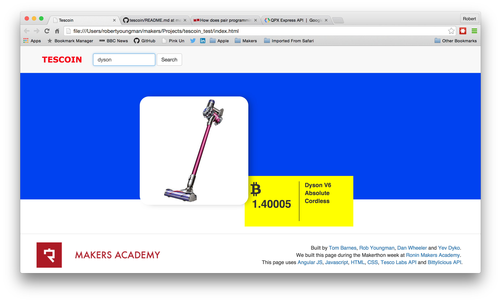

Objective of the Tescoin project
================================

To develop a website which enable users to search the Tesco on-line grocery catalog and display the results priced in bitcoins using the real time exchange rate obtained from the Bittylicious Bitcoin exchange. 

User Stories
============


Link to user stories:
* https://docs.google.com/spreadsheets/d/1Q6hG9aBY7lSwlUnbUx1afprLKVxiOUhd8JSAa1beGms/edit#gid=0&vpid=A1

Deployment locally
=====================================================

* Install Node/NPM (https://nodejs.org/en/download/)

* Clone this project

``` npm install ``` from within the project root directory

``` open index.html ``` 
(or ``` node tescoin.js ``` to start on Express server and visit localhost:5000 in your browser)

Deploying to Heroku
===================

``` heroku create <your app name> ```

``` git push heroku master ```

``` heroku open ```


Instruction for using Tescoin website
=====================================

* Tesco Labs online grocery store API requires users to: 
  * have registered as a developer and registered their app
  * have a Tesco grocery account
* Link to developer registration is: 
  * https://secure.techfortesco.com/tescoapiweb/login.aspx
* The Tesco API requires the user to obtain a Tesco API session key. You need to generate a session before you can use Tescoin. Follow the example on the Tesco login WIKI (you can input the final URL directly into your browser address bar):
  * https://secure.techfortesco.com/tescoapiweb/wiki/login.html
* Open up Tescoin and input your session key
* Search for groceries on Tescoin
* Get up-to-the-minute prices served by Tesco and Bittylicious
* Full details of how to use the Tesco Labs API are given here:
  * https://secure.techfortesco.com/tescoapiweb/wiki/intro.html


Screen shots
============




